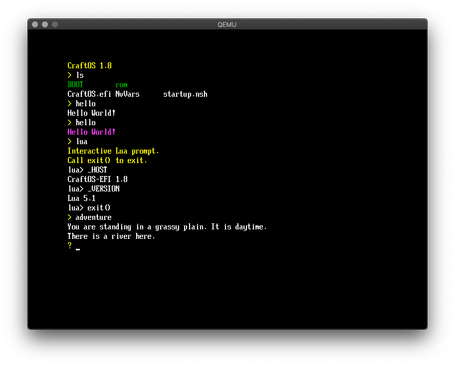

# craftos-efi
CraftOS for UEFI systems. Runs as an EFI application.



## Building
1. Download the source
2. Download EDK II
3. Set up environment
4. Build
5. Figure out why build didn't work
6. ???
7. Profit.

(Just use the releases page.)

## Usage
The output .efi file MUST be run under the EFI shell after changing to the device with the ROM files:
```
FS0:
CraftOS
```
This is done automatically in the image file in the releases.